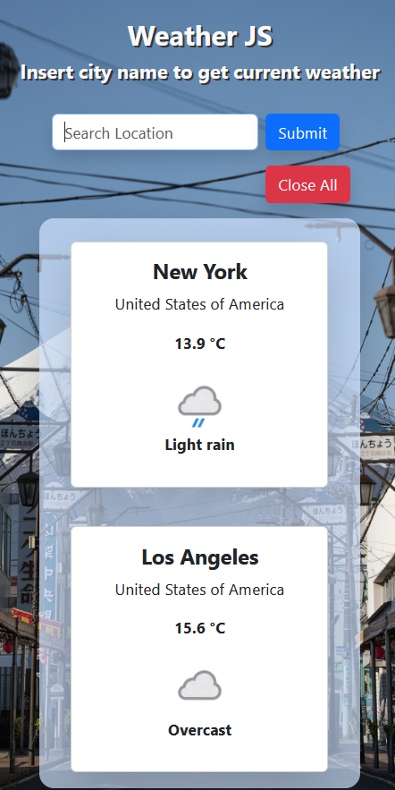

# WeatherJS

[](https://app.netlify.com/projects/bootstrap-weather-js/deploys)

Simple weather website to display current weather data based on city name by calling Free Weather Api.

[Live demo](https://bootstrap-weather-js.netlify.app/)

### PC view:
 

### Mobile view:



### Background Image From: [Unsplash](https://unsplash.com/photos/a-car-driving-down-a-street-with-a-mountain-in-the-background-fErX8KaiVMU)

## Features
- **Responsive Design**: Accessible on both desktop and mobile devices.
- **Search Bar**: Search current weather of any city.
- **Close All Button**: Clear all weather data in webpage.
- **Invalid Input Alert**: Pop up when input is invalid.

## Tools Used

- **Frontend :**
  - HTML
  - CSS
    - Bootstrap framework npm package
  - JavaScript
    - Node.js v 22.16.0
    - Vite

- **API :** [FreeWeatherAPI](https://www.weatherapi.com/)

- **Vscode Live Server Extension** (Optional)

## Getting Started

Follow these steps to set up the project locally:

### 1. **Clone the Repository**:

   ```bash
   git clone https://github.com/ISE-S46/WeatherJS.git
   cd WeatherJS
   ```
### 2. **Get API key**:

- Go to [FreeWeatherAPI](https://www.weatherapi.com/)
- Sign up account
- Go to APi tab and copy API key

### 3. **Create config.js**:

- create file name .env
```js
VITE_API_key = "your_api_key";
```

### 4. **Launch the Application**:
```bash
npm run build
npm run preview
```